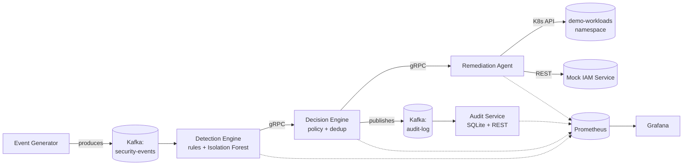

# Autonomous Threat Remediation Pipeline

[](https://github.com/DaraSingh45/autonomous-threat-remediation-pipeline/actions/workflows/ci.yml)
[](LICENSE)
[](https://www.python.org/downloads/)

A working, end-to-end analog of a real-time SOAR (Security Orchestration, Automation, and Response) pipeline: synthetic security telemetry flows through Kafka into a hybrid rule-based + machine-learning detection engine, a policy-driven decision service, and an autonomous remediation agent that isolates compromised Kubernetes pods or revokes credentials — all with a complete, queryable audit trail and Grafana dashboards showing the measured MTTD/MTTR impact of automation.

It's built to mirror the "detect → decide → autonomously act" architecture pattern behind modern SOAR platforms like Cortex XSIAM — using the same category of building blocks (Kafka, gRPC, Kubernetes) — as a hands-on demonstration of that architecture, not an official integration with or endorsement by any vendor.


## Table of contents

- [What it does](#what-it-does)
- [Architecture](#architecture)
- [Tech stack](#tech-stack)
- [Quickstart](#quickstart)
- [Project structure](#project-structure)
- [Testing](#testing)
- [Kubernetes deployment](#kubernetes-deployment)
- [Documentation](#documentation)
- [Design decisions & honest limitations](#design-decisions--honest-limitations)
- [Roadmap](#roadmap)
- [License](#license)

## What it does

1. **Ingests** synthetic security telemetry (failed logins, unusual process spawns, network egress anomalies, privilege escalation, port scans) onto Kafka at a configurable rate, mixing continuous benign noise with periodic realistic attack bursts.
2. **Detects** verified threats using a deterministic rule engine (brute force thresholds, known-bad IPs, blocklisted processes, large exfil transfers, privilege escalation, port scans) combined with a scikit-learn Isolation Forest anomaly model — a hybrid approach where the ML model can catch weak early signals before a rule's threshold trips.
3. **Decides** whether to act via policy: severity threshold, per-entity dedup/cooldown (no remediation storms), and a toggle between fully autonomous action and a simulated human-analyst triage delay (for the MTTR comparison below).
4. **Acts** autonomously — the Remediation Agent isolates a compromised pod (label + deny-all `NetworkPolicy`, not deletion, to preserve forensic state) via the real Kubernetes API, or revokes a credential via a mock IAM service, in milliseconds.
5. **Records** a complete audit trail for every incident — which rule/model fired, the policy reasoning, what action was taken, and the full timing breakdown — queryable via REST and visualized in Grafana, including a real **measured MTTR reduction** from autonomous vs. simulated-manual remediation.

## Architecture



Full component breakdown, data flow, and the MTTD/MTTR measurement methodology: **[docs/ARCHITECTURE.md](docs/ARCHITECTURE.md)**.


## Tech stack

| Layer | Choice |
|---|---|
| Telemetry backplane | Apache Kafka (KRaft mode, no Zookeeper) |
| Inter-service RPC | gRPC (Protocol Buffers, see `proto/pipeline.proto`) |
| Detection | Rule engine + scikit-learn `IsolationForest` |
| Remediation targets | Kubernetes API (`kubernetes` Python client) + mock REST IAM |
| Services | Python 3.12, FastAPI (REST services), grpcio (RPC services) |
| Audit storage | SQLite |
| Observability | Prometheus + Grafana (auto-provisioned dashboard) |
| Local orchestration | Docker Compose |
| Cluster orchestration | Kubernetes manifests (kind / minikube tested) |
| CI | GitHub Actions (lint, unit tests, Docker builds, manifest schema checks) |

## Quickstart

```bash
git clone https://github.com/DaraSingh45/autonomous-threat-remediation-pipeline.git
cd autonomous-threat-remediation-pipeline
docker compose up --build
```

Then open:

- **Grafana** → http://localhost:3000 (`admin` / `admin`)
- **Audit trail (JSON)** → http://localhost:8090/audit
- **Prometheus** → http://localhost:9090

Full setup instructions (including the Kubernetes path and the before/after-automation comparison) are in **[docs/SETUP.md](docs/SETUP.md)**. A ready-to-run interview demo script is in **[docs/DEMO_WALKTHROUGH.md](docs/DEMO_WALKTHROUGH.md)**.

## Project structure

```
.
├── proto/pipeline.proto              # gRPC contract shared by 3 services
├── services/
│   ├── common/                       # shared schemas, Kafka helpers, logging, metrics
│   ├── event_generator/              # synthetic telemetry producer + attack scenarios
│   ├── detection_engine/             # rule engine + Isolation Forest + trained model
│   ├── decision_engine/              # policy, dedup, autonomous/manual mode, audit emission
│   ├── remediation_agent/            # Kubernetes pod isolation + mock IAM revocation
│   ├── mock_iam_service/             # FastAPI mock identity provider
│   └── audit_service/                # Kafka consumer + SQLite + REST + MTTD/MTTR metrics
├── k8s/
│   ├── base/                         # namespaces, RBAC, Kafka, all 6 service Deployments
│   ├── demo-workloads/               # sample pods the Remediation Agent protects
│   └── monitoring/                   # Prometheus + Grafana Deployments
├── monitoring/
│   ├── prometheus/prometheus.yml     # scrape config (shared by compose + k8s)
│   └── grafana/                      # datasource + dashboard provisioning, dashboard JSON
├── tests/                            # pytest unit tests (rule engine, anomaly model, policy, remediation)
├── scripts/                          # proto codegen, local demo, k8s deploy
├── docs/                             # architecture, setup, demo script, threat scenario reference
├── .github/workflows/ci.yml          # lint + test + Docker build + manifest validation
└── docker-compose.yml
```

## Testing

```bash
make install
make test     # 23 pytest unit tests: rule engine, anomaly model, policy/dedup, remediation actions
make lint     # ruff
```

CI runs the same checks on every push, plus a Docker build of all six service images and Kubernetes manifest schema validation. See `.github/workflows/ci.yml`.

## Kubernetes deployment

```bash
kind create cluster --name atrp
./scripts/deploy_k8s.sh kind
kubectl -n demo-workloads get pods --show-labels -w   # watch quarantine=true appear live
```

This deploys everything with `K8S_MODE=real`, so the Remediation Agent's RBAC-scoped ServiceAccount (see `k8s/base/rbac.yaml`) actually labels and `NetworkPolicy`-isolates a real demo pod when a detection fires. Full walkthrough: [docs/SETUP.md](docs/SETUP.md#kubernetes-deployment).

## Documentation

| Doc | Contents |
|---|---|
| [docs/ARCHITECTURE.md](docs/ARCHITECTURE.md) | Full data flow, component responsibilities, technology rationale, MTTD/MTTR methodology, production-hardening roadmap |
| [docs/SETUP.md](docs/SETUP.md) | Prerequisites, local + Kubernetes setup, troubleshooting |
| [docs/DEMO_WALKTHROUGH.md](docs/DEMO_WALKTHROUGH.md) | Step-by-step interview demo script with talking points |
| [docs/THREAT_SCENARIOS.md](docs/THREAT_SCENARIOS.md) | The 5 synthetic attack scenarios, MITRE ATT&CK mapping, detection → remediation mapping |
| [CONTRIBUTING.md](CONTRIBUTING.md) | How to add a rule, a remediation action, or change the gRPC contract |

## Design decisions & honest limitations

This project is deliberately upfront about being a high-fidelity **analog**, not a production security product:

- Kafka is single-broker with no replication; Kubernetes is a single-node kind/minikube cluster; the IAM service is an in-memory mock; there's no mTLS between services.
- The demo's Kubernetes pods use fixed literal names (rather than resolving dynamic pod names via label selectors against a Deployment) so the Remediation Agent has something deterministic to target in a demo — a real system would resolve pods dynamically.
- MTTD here measures pipeline processing latency (event → verified detection), not "time to notice a breach in the wild," since there's no real breach to notice.

The full table of what's simplified and what a production system would add is in [docs/ARCHITECTURE.md](docs/ARCHITECTURE.md#production-considerations-what-this-demo-deliberately-simplifies) — and being able to walk through that table is, deliberately, part of what this project demonstrates.

## Roadmap

- [ ] mTLS between all gRPC services
- [ ] Swap SQLite → Postgres for the audit trail
- [ ] OpenTelemetry distributed tracing across the gRPC hops
- [ ] Human-approval gate for a configurable subset of high-blast-radius actions
- [ ] Multi-broker Kafka via the Strimzi operator for the Kubernetes deployment
- [ ] Dynamic pod resolution via label selectors instead of fixed demo pod names

## License

MIT — see [LICENSE](LICENSE).
