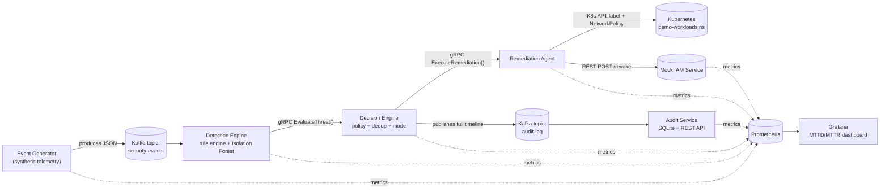

# Architecture

## Data flow



## Components

| Service | Role | Protocol in | Protocol out |
|---|---|---|---|
| `event-generator` | Synthesizes security telemetry (failed logins, process spawns, network egress, privilege escalation, port scans), mixing benign background noise with periodic labeled attack bursts. | — | Kafka producer |
| `detection-engine` | Runs the deterministic rule engine and the Isolation Forest anomaly model against every event; escalates verified detections. | Kafka consumer | gRPC client → `decision-engine` |
| `decision-engine` | Applies remediation policy (severity threshold, per-entity dedup/cooldown, autonomous vs. simulated-manual mode), drives the Remediation Agent, and publishes the full audit record. | gRPC server | gRPC client → `remediation-agent`; Kafka producer (`audit-log`) |
| `remediation-agent` | The only component authorized to act on real infrastructure. Executes pod isolation (K8s API) or credential revocation (mock IAM REST call). | gRPC server | Kubernetes API / REST |
| `mock-iam-service` | Stand-in identity provider; tracks active/revoked users in memory. | REST | — |
| `audit-service` | Durable, queryable record of every detection → decision → remediation lifecycle; computes MTTD/MTTR. | Kafka consumer, REST | — |

## Why these technology choices

- **Kafka over Redis Streams**: the brief explicitly mirrors a "high-throughput telemetry backplane" story; Kafka's consumer-group semantics also let you horizontally scale `detection-engine` for free (multiple replicas sharing the same partitions) without any code change.
- **gRPC between detection → decision → remediation**: these are the pipeline's latency-critical, internal, service-to-service hops — exactly gRPC's sweet spot (binary protobuf, HTTP/2 multiplexing, generated strongly-typed stubs). REST is used instead for the Mock IAM Service because that call models an integration boundary with a third-party system (a real IdP) you wouldn't control the protocol for.
- **Isolation Forest over a supervised model**: SOAR anomaly detection is fundamentally an unsupervised problem in production — you rarely have enough *labeled* attack examples for your specific environment. Isolation Forest also has no requirement that anomalies form a dense cluster (unlike e.g. DBSCAN-based approaches), which suits sparse, bursty attack telemetry.
- **kafka-python over confluent-kafka**: no librdkafka native build dependency, so every Docker image builds identically on any machine without extra system packages. Swap this for `confluent-kafka` or `aiokafka` if you need to push past this demo's modest throughput.
- **SQLite for the audit trail**: zero extra infrastructure for a read-mostly log in a portfolio/demo context. Swap for Postgres in `services/audit_service/db.py` without changing any calling code.
- **Isolate, don't delete**: the Remediation Agent labels + `NetworkPolicy`-quarantines a suspicious pod rather than deleting it, preserving forensic state (a real IR consideration, not just a demo nicety).

## The MTTD/MTTR "before vs. after automation" story

Every `AuditRecord` (see `services/common/schemas.py`) carries the full timeline of one incident:

```
event occurs → detected → decided → remediation started → remediation completed
     |______________|         |______________________________|
        MTTD (ms)                        MTTR (ms)
```

- **MTTD** = `detected_at_ms - event_timestamp_ms` — this measures pipeline processing latency (Kafka + rule/ML evaluation), not "time to notice a breach in the wild" the way a real enterprise's MTTD would. It's an honest proxy: how fast does *this* pipeline turn telemetry into a verified detection.
- **MTTR** = `completed_at_ms - detected_at_ms` — this is where the automation story lives. The Decision Engine's `AUTONOMOUS_MODE` flag controls whether a detection is remediated immediately, or after a `SIMULATED_MANUAL_TRIAGE_SECONDS` delay that stands in for a human analyst's triage time. Running the same pipeline in both modes and comparing the `mttr_seconds{mode=...}` histograms in Grafana is the "before vs. after automation" comparison from the original brief — done as a real, measured comparison rather than a hardcoded slide number.

## Production considerations (what this demo deliberately simplifies)

This is a portfolio-grade analog of a SOAR "detect → decide → act" pipeline, not a production security product. Being upfront about the gap is itself the point — it's exactly the kind of judgment call a security engineering interview will probe:

| Area | This project | A real production system would add |
|---|---|---|
| Transport security | Plaintext gRPC/Kafka inside a trusted docker/k8s network | mTLS between all services (e.g. via a service mesh or `grpc.ssl_channel_credentials`), Kafka SASL/ACLs |
| Identity integration | In-memory mock IAM | Real IdP admin APIs (Okta, Azure AD, AWS IAM Identity Center), with scoped service credentials in a secrets manager, not env vars |
| Kafka durability | Single broker, no replication | Multi-broker cluster (Strimzi operator on k8s, or a managed service), `min.insync.replicas` tuning, schema registry |
| Remediation approval | Fully autonomous for high/critical severity | A human-approval gate for high-blast-radius actions, with the current autonomous path reserved for pre-approved, low-blast-radius playbooks |
| Detection sophistication | One IsolationForest over 7 hand-picked features | Feature store with real historical baselining, ensemble of multiple model types, supervised fine-tuning on confirmed incidents, entity-behavior analytics over longer time windows |
| Pod targeting | Fixed literal pod names for the demo | Resolve current pod(s) via label selectors against the owning Deployment/StatefulSet, since real pod names are dynamic |
| Observability | Prometheus + Grafana, structured JSON logs | Distributed tracing (OpenTelemetry) across the gRPC hops, log shipping to a SIEM, alerting rules on top of the Prometheus metrics already exposed here |
| Multi-tenancy / scale | Single-namespace, single-replica everything | Horizontal scaling of `detection-engine` via Kafka consumer groups (already compatible), per-tenant RBAC boundaries |
